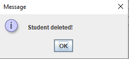

# DatabaseTableGUI
A Database table using javax.swing and java.awt where you can Add,Remove,Search for Available data based on ID and Sort 

# Table of Contents

* [App class ](https://github.com/Cavani99/DatabaseTableGUI/tree/main#app-class)
* [Entity class](https://github.com/Cavani99/DatabaseTableGUI/tree/main#entity-class)
* [Table Model class](https://github.com/Cavani99/DatabaseTableGUI/tree/main#tablemodel)
* [Frame class](https://github.com/Cavani99/DatabaseTableGUI/tree/main#frame)
    - [The Frame](https://github.com/Cavani99/DatabaseTableGUI/tree/main#the-frame)
    - [Init Pagination method](https://github.com/Cavani99/DatabaseTableGUI/tree/main?tab=readme-ov-file#initpagination)
    - [Last,Next,Previous,First buttons](https://github.com/Cavani99/DatabaseTableGUI/tree/main?tab=readme-ov-file#lastnextpreviousfirst-buttons)
    - [Add Student button](https://github.com/Cavani99/DatabaseTableGUI/tree/main?tab=readme-ov-file#add-student-button)
    - [Search by ID button](https://github.com/Cavani99/DatabaseTableGUI/tree/main?tab=readme-ov-file#search-by-id-button)
    - [Remove button](https://github.com/Cavani99/DatabaseTableGUI/tree/main?tab=readme-ov-file#remove-button)
    - [Refresh button](https://github.com/Cavani99/DatabaseTableGUI/tree/main?tab=readme-ov-file#refresh-button)
    - [autoResizeColumn method](https://github.com/Cavani99/DatabaseTableGUI/tree/main?tab=readme-ov-file#autoresizecolumn-method)
* [Service class](https://github.com/Cavani99/DatabaseTableGUI/tree/main?tab=readme-ov-file#service)
    - [insert command](https://github.com/Cavani99/DatabaseTableGUI/tree/main?tab=readme-ov-file#insert-command)
    - [find commands](https://github.com/Cavani99/DatabaseTableGUI/tree/main?tab=readme-ov-file#find-commands)
    - [count commands](https://github.com/Cavani99/DatabaseTableGUI/tree/main?tab=readme-ov-file#count-commands)
    - [order commands](https://github.com/Cavani99/DatabaseTableGUI/tree/main?tab=readme-ov-file#order-commands)
    - [remove commands](https://github.com/Cavani99/DatabaseTableGUI/tree/main?tab=readme-ov-file#remove-command)
* [How to use for you database table](https://github.com/Cavani99/DatabaseTableGUI?tab=readme-ov-file#how-to-use-for-your-database-table-)
    - [Changes in App class](https://github.com/Cavani99/DatabaseTableGUI/tree/main?tab=readme-ov-file#changes-in-app-class)
    - [Changes in Entity/Student class](https://github.com/Cavani99/DatabaseTableGUI?tab=readme-ov-file#changes-in-entitystudent-class)
    - [Changes in Frame class](https://github.com/Cavani99/DatabaseTableGUI/tree/main?tab=readme-ov-file#changes-in-frame-class)
    - [Changes in Service class](https://github.com/Cavani99/DatabaseTableGUI/tree/main?tab=readme-ov-file#changes-in-service-class)
    - [Changes in TableModel class ](https://github.com/Cavani99/DatabaseTableGUI/tree/main?tab=readme-ov-file#changes-in-tablemodel-class)

---
## App class
Here is where we use the information for the database to connect to the Service,
and also initialize  a new Frame with a TableModel.

---
## Entity class

We hold the information about the rows of an individual database
entry.Currently, it's a student data,and every student has an id,
first name,last name and department.

---

## TableModel 

This is where the **Table** with the students is made.
Every student is saved in a List of Students.There are methods
for adding a student("save" method),editing,deleting,finding based on 
id and getting the number of students.

---
## Frame

The information for the JFrame.We use the TableModel,the DataService,
and some buttons,labels,comboBox. 

## The Frame

In initComponents() we add the components and make the layout.In
initPagination(),we decide which elements are printed to the 
table and how they are sorted.

### initPagination()

### Last,Next,Previous,First buttons

We get the entries depending on the button,if possible

### Add Student button

This happens in the **jButtonAddActionPerformed()** method.You have to write
the ID first,then first name,last name,and finally the department the student is
studying in.This is done using an InputDialog.

You have to write a valid ID,to continue to the next information.
A **valid ID** needs to consist only of numbers,be exactly 6 symbols long and not 
to be used already. First we search if the ID has any character,not being a number.
If it does,we get this message!

If the **ID** is not exactly 6 symbols:

If the **ID** is 6 symbols consisting only by numbers,we then 
look if it already exists in the database,If it does:

Else it's considered valid, and you can continue to write the First Name and then Last Name.
They are valid if they are not empty(there are more than 0 characters).Same can
be said for the department.

If everything is valid the new student is added to the database and to
the table, and you get this message:

You can also cancel adding a new entry whenever you want.

### Search by ID button

**jButtonSearchActionPerformed()** is used for that.I use the boolean
variable **refresh** to get only the student with this ID.

When the ID is present:

If the ID doesn't exist:

### Sort button

In **jButtonSortActionPerformed()**.You get the options to sort by ID,First Name,Last Name or Department.It depends on the value 
of the input and if the value is not equal to either **0,1,2 or 3** ,nothing happens.The ordering
happens in initPagination() (or the call for the order), in this method only the boolean variables are changed.

Ordered by Department:

### Remove button

Using the **jButtonRemoveActionPerformed()** method.The students
are removed by given ID value,because it's unique.

If the ID doesn't exist:

If the student is removed successfully:

### Refresh button
It simply makes the boolean variable **refresh** to **false** which 
allows to show all the entries.

### autoResizeColumn method

Used for more dynamic resizing of the different columns.

---
## Service

This is where we make connection with the database if possible and use it.
In every method,first we try to make a connection and when successful ,the
intended operation is done,otherwise we get an information about the error.
SQL queries are used to manipulate the Database.

### insert command:
In the **save(Student student)** method we add a new entry to the database,which is executed 
after we use valid characters for the ID,Names and Department in the **Add button**.

### find commands:

**findall(page,pageSize)** is used to get all the students from the database.

**find(id)** is almost the same,but 
It's used to get only the student with the given ID. **Exists(id)** is also simular,
but it returns a boolean value(if a student with this ID exists,it returns true ,otherwise
its false).

### count commands:
Returns the number of entries in the database.

**countOne(id)** returns only 1 or 0(if a student with **id** exists ,its **1** otherwise it returns **0**).

### order commands:
Used to order the data based on either ID,First or Last Name ,or Department.

Order by ID:

### remove command:
Delete a student with this **ID** from the Database - **remove(id)**) .

---

## How to use for your database table :

### Changes in App class
* Use your data source information

  

### Changes in Entity/Student class

* Change the variables based on your columns in your database table, with the right data types.Also you can modify the getter/setter methods.

  
  
* Change the information in **toString()** method

### Changes in Frame class

* in [jButtonAddActionPerformed()](https://github.com/Cavani99/DatabaseTableGUI/blob/main/DatabaseTableGUI/src/Frame.java#L321) you can keep the ID validator, if you want, but it only accepts exactly 6 digits ,if you want to fix that modify the **len** variable
    - for validating a varchar non-nullable column you can just use the Names or Department validator ,but just change the variable and the text.
    - I also added a date validator(for a date like yyyy-mm-dd),if you need to use it :
      
* In [jButtonSortActionPerformed()](https://github.com/Cavani99/DatabaseTableGUI/blob/main/DatabaseTableGUI/src/Frame.java#L519) :
    - change the text here 
    - add boolean values, based with which column you want to sort:
      
       

    Then set them to true, and all other values to false, based on the sort text you wrote from one picture above.You may need to add more boolean variables or cases in the switch ,if you have more sort options. 

    

* In [initPagination()](https://github.com/Cavani99/DatabaseTableGUI/blob/main/DatabaseTableGUI/src/Frame.java#L49) you need to add your sort variables, and also your OrderByColumn() method  located in the Service class like this(see the OrderByColumn  explanation in **In Service class** header).

    

### Changes in Service class

* In the queries use your **Table name** and the **name of the columns** you use. If your table is cars, change students to cars , or if the id is car_id, change the Student_ID to car_id.

    

* Also in the ResultSet use your column names and the right types.
  

* In the **OrderByColumn** (where **Column** is the column you want to order by) just change the table to your table and the column you want to use to order
  

### Changes in TableModel class 

* In the HEADER variable, add the column names you want.

* In the [getValueAt()](https://github.com/Cavani99/DatabaseTableGUI/blob/main/DatabaseTableGUI/src/TableModel.java#L57) add the getters of your columns, if you want. 

---
Using other database table:

  

