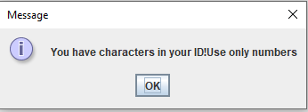

# DatabaseTableGUI
A Database table using javax.swing and java.awt where you can Add,Remove,Search for Available data based on ID and Sort 

---
## App class
Here is where we use the information for the database to connect to the Service,
and also initialize  a new Frame with a TableModel.

* In the picture it's without password,otherwise there is one :)

---
## Student class

We hold the information about the rows of an individual database
entry.Currently, it's a student data,and every student has an id,
first name,last name and department.

---

## TableModel 

This is where the **Table** with the students is made.
Every student is saved in a List of Students.There are methods
for adding a student("save" method),editing,deleting,finding based on 
id and getting the number of students.

---
## Frame

The information for the JFrame.We use the TableModel,the DataService,
and some buttons,labels,comboBox. 

## The Frame

In initComponents() we add the components and make the layout.In
initPagination(),we decide which elements are printed to the 
table and how they are sorted.

### initPagination()

### Last,Next,Previous,First buttons

We get the entries depending on the button,if possible

### Add Student button

This happens in the **jButtonAddActionPerformed()** method.You have to write
the ID first,then first name,last name,and finally the department the student is
studying in.This is done using an InputDialog.

You have to write a valid ID,to continue to the next information.
A **valid ID** needs to consist only of numbers,be exactly 6 symbols long and not 
to be used already. First we search if the ID has any character,not being a number.
If it does,we get this message!

If the **ID** is not exactly 6 symbols:

If the **ID** is 6 symbols consisting only by numbers,we then 
look if it already exists in the database,If it does:

Else it's considered valid, and you can continue to write the First Name and then Last Name.
They are valid if they are not empty(there are more than 0 characters).Same can
be said for the department.

If everything is valid the new student is added to the database and to
the table, and you get this message:

You can also cancel adding a new entry whenever you want.

### Search by ID button

**jButtonSearchActionPerformed()** is used for that.I use the boolean
variable **refresh** to get only the student with this ID.

When the ID is present:

If the ID doesn't exist:

### Sort button

In **jButtonSortActionPerformed()**.You get the options to sort by ID,First Name,Last Name or Department.It depends on the value 
of the input and if the value is not equal to either **0,1,2 or 3** ,nothing happens.The ordering
happens in initPagination() (or the call for the order), in this method only the boolean variables are changed.

Ordered by Department:

### Remove button

Using the **jButtonRemoveActionPerformed()** method.The students
are removed by given ID value,because it's unique.

If the ID doesn't exist:

If the student is removed successfully:

### Refresh button
It simply makes the boolean variable **refresh** to **false** which 
allows to show all the entries.

### autoResizeColumn method

Used for more dynamic resizing of the different columns.

---
## Service

This is where we make connection with the database if possible and use it.
In every method,first we try to make a connection and when successful ,the
intended operation is done,otherwise we get an information about the error.
SQL queries are used to manipulate the Database.

### insert command:
In the **save(Student student)** method we add a new entry to the database,which is executed 
after we use valid characters for the ID,Names and Department in the **Add button**.

### find commands:

**findall(page,pageSize)** is used to get all the students from the database.

**find(id)** is almost the same,but 
It's used to get only the student with the given ID. **Exists(id)** is also simular,
but it returns a boolean value(if a student with this ID exists,it returns true ,otherwise
its false).

### count commands:
Returns the number of entries in the database.

**countOne(id)** returns only 1 or 0(if a student with **id** exists ,its **1** otherwise it returns **0**).

### order commands:
Used to order the data based on either ID,First or Last Name ,or Department.

Order by ID:

### remove command:
Delete a student with this **ID** from the Database - **remove(id)**) .

---

